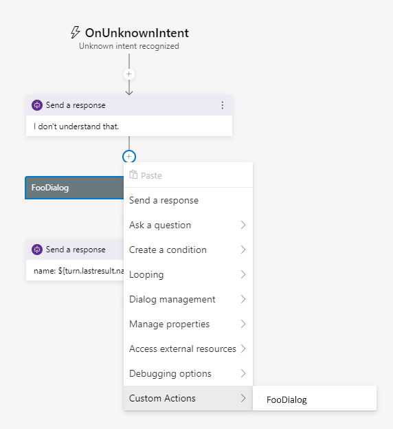
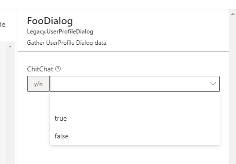

# **Using existing dialogs with Adaptive stack and Composer**

This article describes how to continue to use your existing dialogs in the Adaptive stack, and how to enable to be used from within declarative files and Composer.

## **All dialogs are actions, all actions are dialogs**

The first thing to understand is that Adaptive Dialogs, Actions and "legacy" dialogs are all just dialogs. The contract is the same, they have a **BeginDialog**, **ContinueDialog**, etc.

What the adaptive stack introduces is a standard mechanism for controlling the execution of a sequence of **Actions**.

> NOTE: **Actions == Dialogs**, so the previous statement can be stated as "The adaptive stack introduces a standard mechanism for controlling the execution of a sequence of **Dialogs**.

The **AdaptiveDialog** is simply a dialog implementation which defines our current **best practices** 

* **Recognizer** - for doing recognition
* **Generator** - for create LG output
* **Triggers** - to have an event model for organizing your actions

These are 100% compatible, which is clear when looking at a code definition of an Adaptive dialog.  Let's say you have a waterfall based dialog called **FooDialog**.  You can just drop it in to a collection of actions as action to take.

```c#
var rootDialog = new AdaptiveDialog()
{
    ...
    Triggers = new List<Trigger>()
    {
        new OnBeginDialog() 
        {
            Actions = new List<Dialog>() // <-- Actions is just a sequence of dialogs
            {
                new SendActivity("Hello world"), // <-- SendActivity is a dialog that simply sends an activity and ends
                new FooDialog(), 		// <-- start FooDialog, it has the dialog focus for N turns until it completes.
                new SendActivity("FooDialog is done"), 
            }
        }
    }
}
```

You can see that the 2 step in the actions is to call the FooDialog. 

## **Declarative files**

The second major thing that the adaptive stack introduces is a **declarative type loader** so that we use json files to define the execution graph of dialogs.  This enables authoring tools like the Bot Framework Composer to be built that work regardless of the underlying runtime language.

A **.dialog** file is simply a JSON file which represents serialized objects.  The deserialization process boils down to

* **$kind** - the kind of object to instantiate 
* **properties** - are used to initialize the object that is instantiated.

The declarative file format is an open ended system that allowed any developer to create new components (dialogs/recognizers/etc.) and describe them to the system so that they can be automatically added to the declarative type loader.

The mechanism for telling the declarative type loader that your type exists is to create a **ComponentRegistration** class which implements **IComponentDeclarativeTypes**  interface. 

``` C#
    public class CustomComponentRegistration : ComponentRegistration, IComponentDeclarativeTypes
    {
        public IEnumerable<DeclarativeType> GetDeclarativeTypes(ResourceExplorer resourceExplorer)
        {
            yield return new DeclarativeType<FooDialog>("MyApp.FooDialog"); // <-- $kind "MyApp.FooDialog" -> FooDialog object
        }

        public IEnumerable<JsonConverter> GetConverters(ResourceExplorer resourceExplorer, SourceContext sourceContext)
        {
            yield break;
        }
    }
```

* The **GetDeclarativeTypes** method returns a definition of $kind -> type. 
* The **GetConverters** method allows custom behavior for instantiating and deserializing the json. *(more on that below...)*

In startup.cs you register your **CustomComponentRegistration** class and the loader now knows about your components. (in this case that there is a **MyApp.FooDialog**).  *in future releases the dotnet core runtime will automatically identify the component registrations in scope.*

``` c#
            ComponentRegistration.Add(new CustomComponentRegistration());
```


That is all you need to do and now you can now create a .dialog file which references FooDialog and defines an instance of it:

```json
{
    "$kind":"Microsoft.AdaptiveDialog",
    ...
    "triggers": [
        {
            "$kind":"Microsoft.OnBeginDialog",
            "actions":[
                {
                    "$kind":"Microsoft.SendActivity",
                    "activity" : "Hello world"
                },
                {
                    "$kind":"MyApp.FooDialog"
                },
                {
                    "$kind":"Microsoft.SendActivity",
                    "activity" : "FooDialog is done"
                },
            ]
        }
    ]
}
```

This is 100% the same as defining it in the code, but the definition can now be edited in a tool such as Composer.

### **Properties**

Any properties for FooDialog exposes can be set via json as well.  Let's say **FooDialog** has a **boolean** property **ChitChat**

``` C#
   new FooDialog() { ChitChat = true }
```

In Json you can simply set it:

```json
{
	"$kind":"MyApp.FooDialog",
    "chitChat":true
},
```

## **Enabling Composer to edit your dialog**

Composer is an open ended GUI for editing assets like .dialog files.  Because any component (Project, Library, Nuget package) can add new types to the loader, it needs a way to know the shape of those objects so it can construct UI for editing them.

We do that using **.schema files** which are simply **json-schema** files.  To describe FooDialog you create a .schema file with the $kind as the file name, so in our example **MyApp.FooDialog.schema**

```
{
    "$schema": "https://schemas.botframework.com/schemas/component/v1.0/component.schema",
    "$role": "implements(Microsoft.IDialog)", <-- Says that this is a dialog and be used any place we consume dialogs.
    "type": "object",
    "title": "MyApp.FooDialog",              <-- name in the menu
    "description": "Gather FooDialog data.", <-- Description in the menu
    "properties": {
        "chitChat": {                        <-- name in the .json
            "type":"boolean",                <-- type of value
            "title":"ChitChat",              <--- title in the UI
            "description":"Set the chit chat to true to enable awesome chattiness."  <-- description in the UI
        }
    }
}
```

The **bf dialog:merge** tool walks all of the dependent libraries, projects, packages and discovers all of the .schema files and rolls them all up into one schema file which drives the UI.  The UI will automatically generate a property sheet with a drop down for True/False for the ChitChat property.




## **Adding expression binding to your dialog**

While it is NOT a requirement for you to use expression properties, adding them enables a powerful feature for dialog authors.

If you notice the only options that are available in Composer are **True/False**, because the property type is **bool**.

``` C#
   public Bool ChitChat { get; set;} = false;
```

You can optionally enable content authors to be able to dynamically bind the value of your property from memory by doing the following 3 steps:

**1. Change from the simple type to an Expression Property** 

In this case this means change the type of the property from **Bool** -> **BooleanExpression**

``` C#
   public BoolExpression ChitChat { get; set;} = false;
```

**2. Change your dialog code to evaluate the expression** 

We need to call a method to bind the data.

``` C#
  {
      bool chitChat = this.ChitChat.GetValue(dc.State); // data bind to memory (or static value)
  }
```

**3. Change property type in the schema file**

Replace the **"type" : "bool"** -> **"$ref" : "schema:#/definitions/booleanExpression"** so Composer knows to light up the expression editor.

```
      "chitChat": {                        <-- name in the .json
            "$ref": "schema:#/definitions/booleanExpression", <-- replaces "bool type" with bool expression definition
            "title":"ChitChat",              <--- title in the UI
            "description":"Set the chit chat to true to enable awesome chattiness."  <-- description in the UI
        }
```

This will enable composer UI to let you write a data binding expression for the property value.

# **Can I invoke my dialogs from Composer without making them declarative?**

Absolutely.  For a dialog to be addressed it needs to exist in one of the **DialogContainer**'s in the call stack.  **DialogContainer**'s expose the **.Dialogs** collection for you to add an arbitrary dialog to the system. There are 2 well known-dialog containers:

* **DialogManager** - Any dialog you add to the DialogManager.Dialogs collection is callable from anywhere, because dialogManager is the most the *rootiness* container.

* **AdaptiveDialog** - Any AdaptiveDialog has a .Dialogs collection that you can add a Dialog to.  This scopes the dialog to only being available to the AdaptiveDialog and any child dialogs it calls.

  ``` c#
     var dm = new DialogManager();
     ...
     // make "FooDialog" available to be called from a dc.BeginDialog("foodialog") or a BeginDialog action in composer
     dm.Dialogs.Add(new FooDialog(userState) { Id = "FooDialog", ChitChat=true });
     ...
  ```

To invoke the dialog from composer you can simply use **BeginDialog** with the ID of the beginDIalog = the id of the dialog that was registered.

# **Some dialogs will need small changes to be declarative**

While many dialogs will be able to be declarative by just adding a registration of the type and creating a .schema files, there are implementations that may require some additional work to enable them to be declarative.

## **You have a constructor that has dependencies**

The dialog type loader by default only **knows how to construct parameterless types**. *FooDialog()* not *FooDialog(UserState)*.  If your dialog is written with arguments passed to the constructor you will have to make changes to let them be declarative.


### **Option 1: Add a parameterless constructor, move arguments to properties**

If the parameters *define how the dialog should behave*, then simply move them to properties on the dialog and they can be defined, deserialized and described as .schema files.


### **Option 2: Add a JsonConverter in your ComponentRegistration**

If the parameters are actually system dependencies like **UserState**, **ConversationState**, then the best bet is to register a **JsonConverter** that instantiates the object with dependency args.

```C#
    public class CustomComponentRegistration : ComponentRegistration, IComponentDeclarativeTypes
    {
        // dependency injection
        private IServiceProvider serviceProvider;

        // capture the serviceProvider
        public CustomComponentRegistration(IServiceProvider serviceProvider) => this.serviceProvider = serviceProvider;

        public IEnumerable<DeclarativeType> GetDeclarativeTypes(ResourceExplorer resourceExplorer)
        {
            yield return new DeclarativeType<FooDialog>("MyApp.FooDialog"); // <-- $kind "MyApp.FooDialog" -> FooDialog object
        }

        public IEnumerable<JsonConverter> GetConverters(ResourceExplorer resourceExplorer, SourceContext sourceContext)
        {
            // use Dependency injection to construct FooDialog
            yield return new DependencyInjectionConverter<FooDialog>(this.serviceProvider);
        }
    }
```

This example is using the **DependencyInjectionConverter<T>** to use dependency injection **IServiceProvider** to resolve **UserState** when constructing **FooDialog(UserState userState)**

If you don't like the DependencyInjectionConverter you can write your own custom JsonConverter very simply...here's an example specifically coded for FooDialog(UserState userState)

```C#
    public class FooDialogConverter : CustomCreationConverter<FooDialog>
    {
        private UserState userState;

        public FooDialogConverter(UserState userState) => this.userState = userState;

        public override FooDialog Create(Type objectType) => new FooDialog(this.userState);
    }
```

## **You use BeginDialog(Options) to control dialog configuration not properties**

If your dialog's behavior is driven by passing in the anonymous BeginDialog(Options) object then you have a couple of options.


### **Option 1: Simply use BeginDialog to call your dialog**

The **BeginDialog** action gives you the ability to construct the Options object that is passed to your dialog's BeginDialog, and this **will simply work without having to change your dialog.** The only issue with that is that you get an experience where there is no GUI support to make sure that you are constructing the option object correctly.


### **Option 2: Move the options arguments to properties on the dialog**

If you move the options to properties on the dialog, and add .schema file for them then the Composer UI will light up an editor for setting your dialogs configuration.


### **Option 3: Create simple wrapper**

If you don't want to change your dialog because it would be a breaking change or it's one that you don't own you can simply create an aggregate. 

Let's assume that FooDialog has no properties and takes options { chitchat: bool } 

```C#
public FooAdaptiveDialog : FooDialog
{
    public FooAdaptiveDialog()
    {
    }

    public BoolExpression ChitChat {get;set; } = false;

    public override OnBeginDialog(dc, options, ...)
    {
        var opts = new 
        {
            chitChat = ChitChat.GetValue(Dc.State)
        };
        return await base.OnBeginDialog(dc, opts);
    }
}
```


